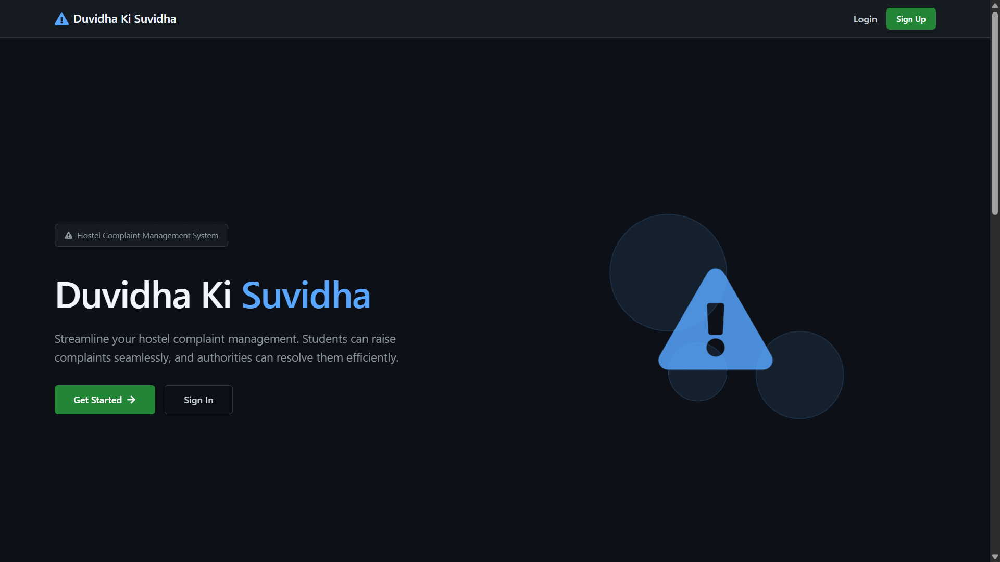
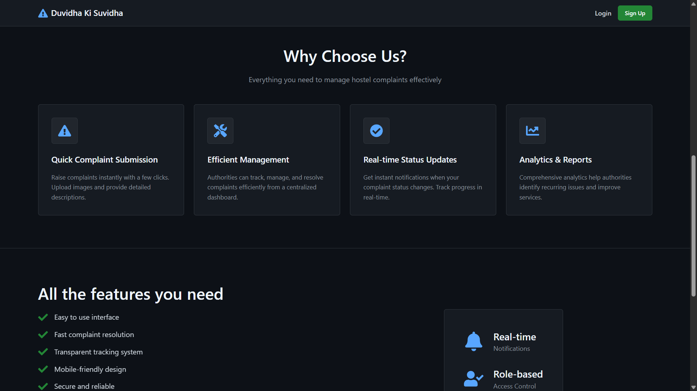
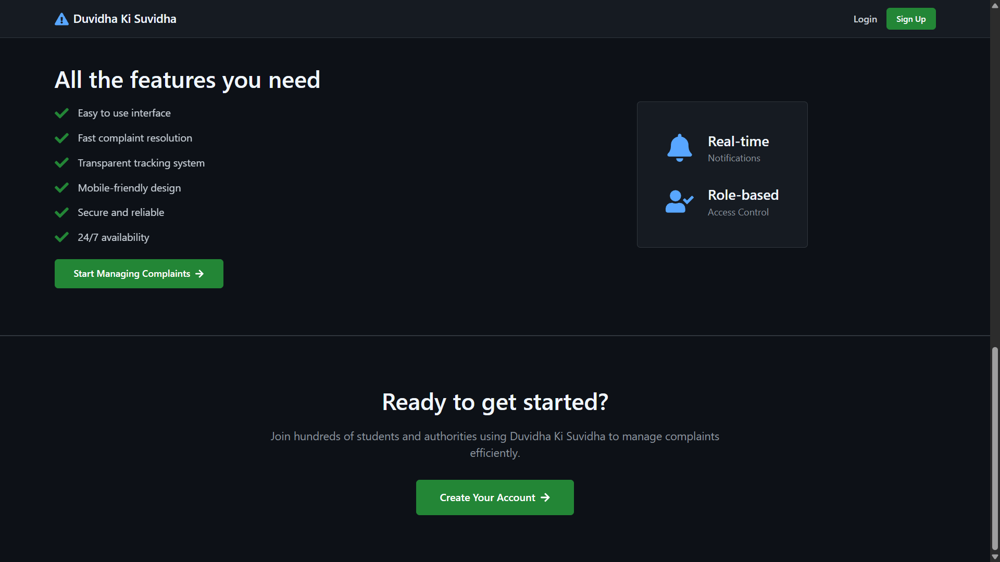
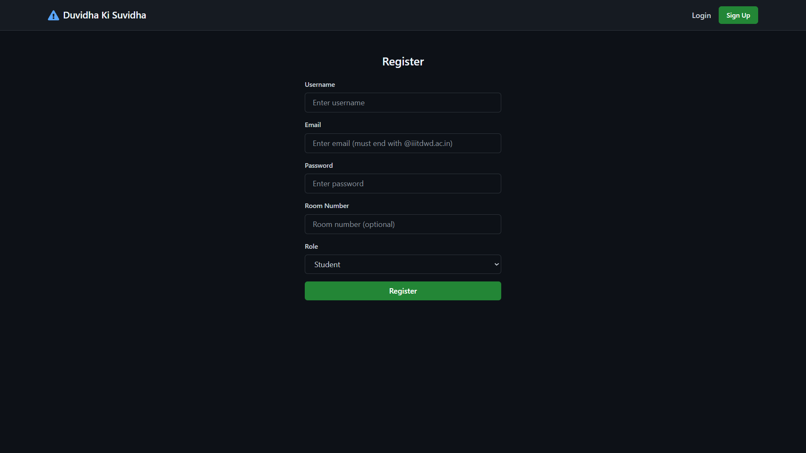
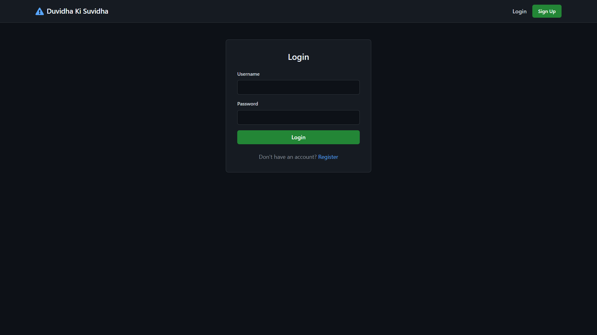
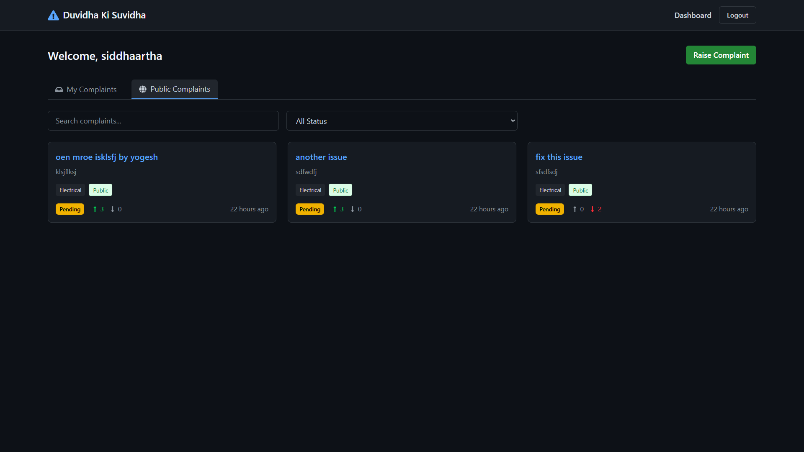
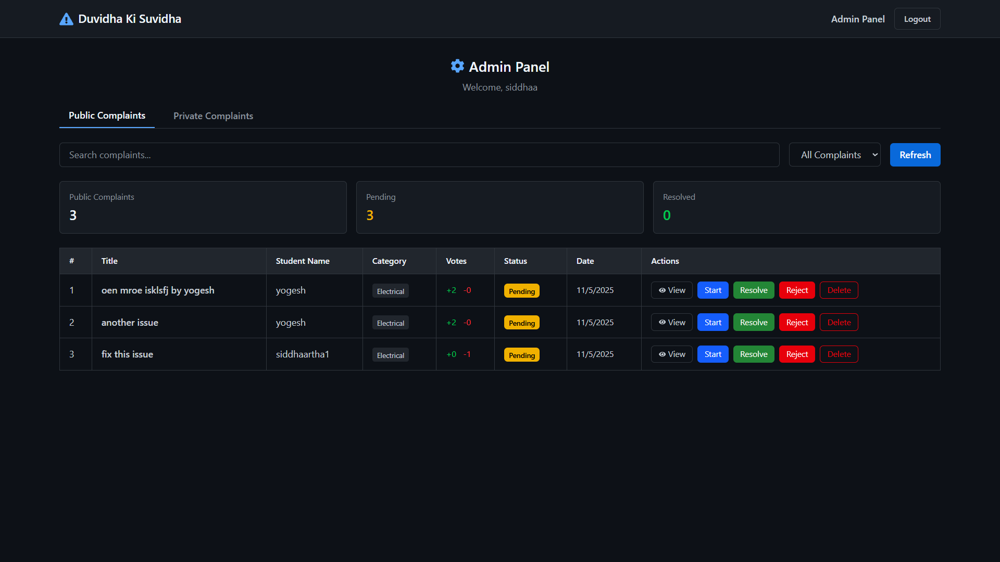

# Duvidha ki Suvidha


## Screenshots

### Landing Page




### Signup Page


### Login Page


### User Dashboard


### Admin Dashboard


## Overview
Duvidha ki Suvidha is a full-stack web application designed to streamline the process of filing, tracking, and managing complaints. It provides a user-friendly platform for citizens to raise issues and for administrators to efficiently resolve them.

## Features
- **User Authentication:** Secure login and registration for users and admins.
- **Complaint Submission:** Users can easily submit complaints with relevant details and attachments.
- **Dashboard:** Personalized dashboard for users to track complaint status and for admins to manage all complaints.
- **Admin Panel:** Admins can view, update, and resolve complaints, with filtering and search capabilities.
- **File Uploads:** Integrated support for uploading images/documents with complaints.
- **Modern UI:** Responsive and intuitive frontend built with React and Vite.
- **RESTful API:** Robust backend powered by Node.js and Express, with MongoDB for data storage.

## Tech Stack
- **Frontend:** React, Vite, Axios
- **Backend:** Node.js, Express
- **Database:** MongoDB
- **Authentication:** JWT
- **File Storage:** Cloudinary

## Folder Structure
- `Frontend/` - React-based client application
- `Backend/` - Node.js/Express server and API

## Getting Started
1. **Clone the repository:**
   ```bash
   git clone https://github.com/AdityaSharma515/Duvidha_ki_Suvidha.git
   ```
2. **Install dependencies:**
   - Frontend:
     ```bash
     cd Frontend
     npm install
     ```
   - Backend:
     ```bash
     cd Backend
     npm install
     ```
3. **Configure environment variables:**
   - Backend: Create a `.env` file in `Backend/` with your MongoDB URI, JWT secret, and Cloudinary credentials.
4. **Run the application:**
   - Backend:
     ```bash
     npm start
     ```
   - Frontend:
     ```bash
     npm run dev
     ```


## Demo
See the screenshots above for a visual walkthrough of the application.

## Contributing
Contributions are welcome! Please open issues or submit pull requests for improvements and bug fixes.

## License
This project is licensed under the MIT License.

---
*For more information, screenshots, and updates, stay tuned!*
